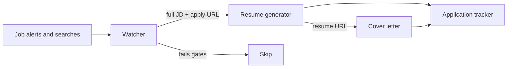

# Agentic job-search pipeline

A multi-agent workflow I designed and run for my own job search.

It turns noisy job alerts into **application-ready packets**: the employer apply page, a one-page tailored resume, and a short cover letter. I did this as a program manager who builds evaluation and data-ops systems, not as a demo of "AI wrote my applications."

This repo is the **public architecture**. The live agents, inbox, source-of-truth resume bank, and tracker are private.

## Why this exists

LinkedIn Job Alerts are a firehose. A typical digest has several roles, truncated listings, tracking URLs, and repeats. Generating a resume for every card floods Drive and wastes attention.

The product question is not "can an agent write a resume?" It is:

- What is the **unit of output** a human can actually use?
- Which **quality gates** keep the system from generating junk?
- How do you split work across specialists so no single agent becomes a god-bot?

## Output contract

Every qualifying job becomes one row:

| Apply URL | Resume | Cover letter |
| --- | --- | --- |
| Employer careers page when possible (Greenhouse, Lever, Ashby, company site). LinkedIn job URL only as fallback. | One-page tailored Google Doc | Short letter grounded in that resume + the posting |

If a posting has no salary, or it misses the compensation floor, or it is a repeat, the system **skips**. Skip is a successful outcome.

## Architecture



Four roles, one coordinator:

| Role | Owns | Does not own |
| --- | --- | --- |
| **Coordinator** | Policy, output contract, when to add or refuse a bot | Writing resumes or letters |
| **Watcher** | Ingest, parse, fetch the real posting, salary/role gates, dedupe | Writing application materials |
| **Resume generator** | One-page tailored resume from a verified source bank | Inventing employers, dates, titles, or metrics |
| **Cover letter** | Short letter from that resume + JD; third link on the tracker | Hunting jobs |

## Quality gates

These are product decisions, not prompts-as-magic.

1. **New work only.** Do not replay a historical inbox backlog on day one.
2. **Posted compensation required.** No salary in the posting → skip. Do not guess.
3. **Floor.** Remote / national roles need a high posted floor. Local-only roles can use a lower floor. A range counts if it actually reaches the floor; a $90k–$120k posting is not "kind of $200k."
4. **Role match.** Title and posting have to look like the target (program / TPM / AI data ops / evaluation / HITL / governance). Adjacent junk in an alert digest gets skipped.
5. **Dedupe by job id.** Same posting from two alerts is one packet.
6. **Fetch the posting.** Email cards are not job descriptions. Follow the link, pull the full JD, prefer the employer apply URL.
7. **No invention.** The source bank is collated from real work. Wording can be tailored. Employers, dates, titles, and metrics cannot be made up.
8. **Letters don't confess.** Cover letters do not say "AI wrote this." For roles that are actually about AI systems, one sentence about having shipped this pipeline is a **project**, not a disclosure.

## What I would tell a hiring manager

This is a small production workflow:

- **Ingest** is unreliable (digests, tracking links, missing salary), so the watcher is a parser and a gate, not a writer.
- **The unit of output** is a packet a human can apply from, not a folder of documents.
- **Specialists beat a god-bot.** Resume quality and cover-letter voice are different jobs. Mixing them made worse artifacts.
- **Skip is a feature.** Volume without gates is how you get a Drive full of mismatched one-pagers.

I am using the same instincts I use on evaluation and data-ops programs: define the contract, put gates where the data is dirty, and keep humans on the last mile (actually applying).

## What's in this repo

```
README.md                 this document
docs/architecture.md      components, data flow, failure modes
prompts/                  sanitized role briefs (not the live ones)
LICENSE                   MIT
```

What's **not** in this repo:

- Personal contact info, inbox contents, or live tracker rows
- The resume source bank
- Agent identifiers, credentials, or connector configs
- Real job descriptions or generated documents

## Prompts vs. production

The files under `prompts/` are **illustrative briefs**: the job of each specialist and the rules it has to obey. They are not a drop-in clone of the running system, and they are not enough to recreate anyone's private search.

If you adapt this, write your own source bank, set your own floors, and keep PII out of git.

## Status

Personal production system. The public artifact here is the design, not a hosted app.
