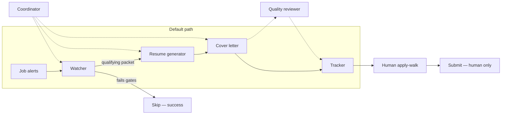
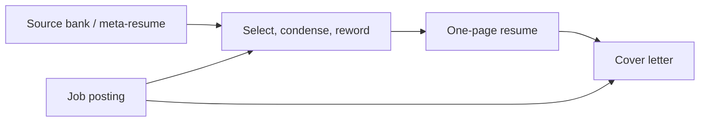
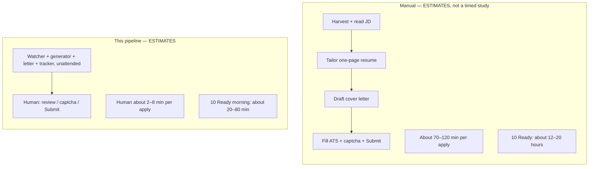

# Job-search helpers

## What this is

I built a few helpers to take the boring parts of my job search off my plate.

Every morning Job Watcher reads job-alert emails and searches new listings until there are up to 10 good ones in my applications queue. Resume Generator builds a one-page resume from my real work history. Quality Reviewer checks it against the job posting for quality, fit, and gaps. Cover Letter Generator writes a short letter from that resume. Consigliere handles surprises, fills in the application, and attaches the PDFs.

I still read the form, double-check what I’m actually sending, do any captcha or login, and click Submit.

This is about 5x faster than doing it by hand. The bots never make up jobs I didn’t have, or skills I don’t have. If a posting uses different words for the same real work, they decide carefully whether to match those words. If the work isn’t in my history, they leave it out.

This page is the public story of how that works. My inbox, my full work history, and the live job list stay private.

## Who does what

**Job Watcher** reads job-alert emails and also searches LinkedIn for new postings. It only keeps roles that fit (the right kind of work, posted pay high enough, posted in the last 60 days). It stops at 10 good ones for the day.

**Resume Generator** opens my private work history (about 10 years of real jobs) and builds a one-page resume for that posting. It picks the relevant parts, shortens them, and may reuse the posting’s words when they still mean the same real work. It will not invent a job, a date, a tool, or a skill.

**Quality Reviewer** reads that resume next to the job posting. It flags weak fit, missing pieces, and anything that sounds made up. If something needs a fix, Resume Generator tries again.

**Cover Letter Generator** writes a short letter from the resume that passed review, not from thin air.

**Consigliere** is the traffic cop. It kicks the others when they stall, fills the application form, attaches the PDFs, and pings me when the only thing left is Submit.

I do captcha, logins, a last look, and the Submit click.

## A typical morning

Times are Pacific.

6:30am — Job Watcher looks at new emails and new listings. For each good one, it adds a row to my job tracking sheet: company, role, posted pay, when it was posted, the apply link, and later the resume and letter links. Status starts as Ready.

7:00am — If we don’t have 10 good ones yet, Consigliere gives everyone a nudge.

8:30am — If we’re still short, I get one ping. If we already have 10, nobody bothers me.

Late morning — When I sit down, Consigliere and I walk the Ready list until those rows say Applied. When I’m close to finishing the queue, Consigliere asks if I want more for the day. Otherwise we just muscle through what we have and e-high-five, because why not.

3:00pm on weekdays — Job Watcher only checks “you got an interview / you got rejected” mail. It does not pile on more new jobs. It just updates my tracking sheet.

## Resume generator in action

I keep one large private file of about 10 years of real work: jobs, dates, what I actually did, and the numbers that are true. It's basically the DISTINCT and UNION of 4 recent resumes that I put real time and effort into. That file never goes on GitHub.

For each posting, Resume Generator does three things:

1. Picks the parts of my history that match this job.

2. Shrinks those parts onto one page. It usually ends up being more than one and less than two when the final doc is generated, because LLMs are ADHD-adjacent, but that's okay. I'm not looking to dazzle with forceful brevity and a clean set of punches. I'm just making sure I am thorough while not completely overwhelming the human who might actually read it.

3. Sometimes uses the posting’s words when they still mean the same real work.

It will not invent a job, a date, a tool, or a skill. If the posting wants something I have never done, that line stays off the page.

Cover Letter Generator only writes after that resume exists. The letter has to match the resume, not a fantasy version of me. These files are not commonly required, but they usually don't go to waste, either. Most application pages ask if you want to explain why you want the job.

Quality Reviewer reads both next to the posting and sends anything fishy back for a fix.

Consigliere will start filling fields, then dump the cover letter material in the "why you want the job" field, and I will usually ruthlessly edit and put things in my own friendlier voice. Nothing I submit, even the resume, ever goes untouched. That's the only way to be.

## What this runs on

This is Cursor and Grok Bot, not a custom app I built from scratch.

Each helper is a Grok Bot with a job. Cursor is where they live, where the morning alarms are set, and where Gmail and Google Drive get plugged in.

The helpers also have a computer of their own: a Linux desktop with Chrome. That’s where they open job sites, fill forms, and save PDFs. When a site needs my password, a captcha, or the Submit click, I take that computer for a minute.

### How Job Watcher finds jobs

1. LinkedIn already emails me Job Alerts. Job Watcher reads those emails through Gmail (that part is a real Google connection, not scraping).

2. Each email is only a teaser, so Watcher opens the job link in Chrome and reads the full posting: pay, when it was posted, and the real apply button.

3. It also searches for extra matches the same way a person would: run a search, open the listings, keep the good ones. That is not a LinkedIn API. **It’s a browser on the helper computer looking at search pages. I’ll say that again: the bot uses a browser and searches for jobs.**

If LinkedIn asks that computer to log in, I have to do that once. Job Watcher does not get a secret feed.

Resumes and letters are Google Docs. The queue is a Google Sheet. Apply pages are whatever the company uses (Greenhouse, Lever, SmartRecruiters, or their own site).

For my own work, this feels like the third big jump I’ve seen in AI. First was self-attention at scale, when text generation actually got useful. Second was chain of thought, and some real ability to break a problem into steps. Third is this: bots that can operate computers, together.

## Stack

This runs on **Cursor + Grok Bot**, not a custom orchestrator.

| Layer | What it is |
| --- | --- |
| Agents | Grok Bot agents, each with a specialist brief |
| Scheduling / tools | Cursor routines and MCP |
| Runtime | A persistent agent Linux computer with Chrome |
| Mail / files | Gmail and Google Drive connectors |
| Artifacts | Google Docs (resumes, letters) and Google Sheets (tracker) |
| ATS surfaces | Greenhouse, Lever, SmartRecruiters (plus employer career pages when those resolve) |

LinkedIn is an **email ingest**, not an API. Job alerts land in Gmail; the watcher reads those messages. There is no LinkedIn posting API in this design.

## Architecture

Default path is a straight line. The coordinator sits **beside** it (policy, kicks, shortfall pings). Submit is never on the agent path.



The Quality reviewer is **optional and off the default path**. Most packets go Watcher → Resume generator → Cover letter → Tracker. A human then walks Ready → Applied and clicks **Submit**.

See [docs/architecture.md](docs/architecture.md) for data flow and failure modes.

## Agents

Specialists beat a god-bot. Resume quality and cover-letter voice are different jobs. Mixing them made worse artifacts.

| Role | Owns | Does not own |
| --- | --- | --- |
| **Coordinator** | Policy, output contract, daily kick, shortfall ping, weekday outcome-mail. When to add or refuse a bot. | Writing resumes or letters. Harvest. Submit. |
| **Watcher** | Ingest (Gmail alerts + searches), parse, fetch the real posting, salary/role/age gates, dedupe, skip log. Hands a packet downstream. | Writing application materials. Clicking Submit. |
| **Resume generator** | One-page tailored Google Doc from a verified source bank. Echo apply URL. Tracker resume link. | Inventing employers, dates, titles, or metrics. Hunting jobs. Letters. |
| **Cover letter** | Short letter grounded in **that** resume + the JD. Third tracker link. Status → Ready. | Hunting jobs. Writing the resume. Submit. |
| **Quality reviewer** (optional, off default path) | A second pass on a packet when asked (facts vs source bank, letter grounded in resume). | Default-path generation. Changing gates. Submit. |

None of them own captcha, ATS file pickers, Gmail/Drive OAuth, login/2FA on the agent computer, or recruiter inbound. Details: [docs/agents.md](docs/agents.md), [docs/human-in-the-loop.md](docs/human-in-the-loop.md). How a one-pager is cut from the source bank: [Resume and cover-letter strategy](#resume-and-cover-letter-strategy).

## Output contract

Every qualifying job becomes one tracker row:

| Apply URL | Resume | Cover letter | Status |
| --- | --- | --- | --- |
| Employer careers / ATS page when possible (Greenhouse, Lever, SmartRecruiters). LinkedIn job URL only as fallback. | One-page tailored Google Doc | Short letter grounded in that resume + the posting | Ready → human walks to Applied |

If a posting has no salary, misses the compensation floor, is a repeat, is older than 60 days, or has **no post date**, the system **skips**. Skip is a successful outcome.

## Resume and cover-letter strategy

The pipeline does not dump a whole career onto every posting. It keeps one private **source bank** (a **meta-resume** / super-resume): a collated, verified file of about **10 years of real work** — employers, titles, dates, bullets, metrics. That bank is the **only fact source**. It is not published. This repo does not contain it.

For each qualifying job, the resume generator:

1. **Selects** the subset of the bank that is relevant to *this* posting (for example evals vs fleet ops vs director of an AI platform — not all three at once).
2. **Condenses** that subset onto **one page**. Extra real experience stays in the bank.
3. **Rewords** kept bullets to match the posting's language and keywords **when the underlying fact is the same**. SQL against evaluation logs can be phrased as operational telemetry if that is what actually happened. Rewording is not a new claim.

Tailoring is choose / shorten / drop / rephrase. It is not invention.

**Hard ban:** never invent employers, dates, titles, tools, or metrics. If the bank cannot support a keyword the JD wants, **omit it**. Do not hallucinate a Tableau dashboard that was never built.

The cover letter is written **after** that resume, from **that resume + the JD only**. Same no-invention rule. Short, specific, no "I am writing to express." No "AI wrote this." It must not claim facts that are not on the tailored resume or in the bank.

The Quality reviewer is optional and off the default path. When invoked, it checks facts against the bank and that the letter is grounded in the resume that was just written.



Facts cannot be created. They can only be selected and rephrased.

## Example policy (gates)

These are product decisions, not prompts-as-magic. Numbers below are **this search's example policy**, not universal advice.

1. **New work only.** Do not replay a historical inbox backlog on day one.
2. **Posted compensation required.** No salary in the posting → skip. Do not guess.
3. **Floor.** Example: **$200k posted**. A range counts only if it actually reaches the floor; a $90k–$120k posting is not "kind of $200k."
4. **Freshness.** Skip if the posting is older than **60 days**, or if there is **no post date**.
5. **Role match.** Title and posting have to look like the target family (program / TPM / AI data ops / evaluation / HITL / governance). Adjacent junk in an alert digest gets skipped.
6. **Dedupe by job id.** Same posting from two alerts is one packet.
7. **Fetch the posting.** Email cards are not job descriptions. Follow the link, pull the full JD, prefer the employer apply URL.
8. **Cap.** At most **10 Ready** packets per day. Extra qualifying jobs wait; do not flood the human.
9. **No invention.** The source bank is collated from real work. Wording can be tailored. Employers, dates, titles, and metrics cannot be made up.
10. **Letters don't confess.** Cover letters do not say "AI wrote this." For roles that are actually about AI systems, one sentence about having shipped this pipeline is a **project**, not a disclosure.

## Daily schedule (Pacific)

Times are **Pacific**. Harvest runs **every day, including weekends**. Outcome-mail is weekdays only.

| Time (PT) | What | Notes |
| --- | --- | --- |
| **6:30am** | Watcher harvest | Daily, including weekends. Work toward the 10 Ready cap. |
| **7:00am** | Coordinator kick | Start generators for packets that passed gates. |
| **8:30am** | Shortfall ping **only** | Ping if Ready is under the cap. Stay quiet if the morning already hit 10. |
| **3:00pm** | Outcome-mail **only** | Weekdays. Not a second harvest. |
| Human, unscheduled | Apply-walk | Ready → Applied. Submit is human-only. |

Full cadence: [docs/schedule.md](docs/schedule.md).

## Human-in-the-loop (limitations, not TODOs)

The pipeline stops at **Ready**. A human finishes the apply. That is the design, not a gap to close with more agents.

- **Captcha** — agents do not solve it.
- **Submit is human-only** — apply-walk is allowed; clicking Submit is not.
- **Gmail / Drive connect** — OAuth is a person in the browser.
- **Login / 2FA on the agent computer** — first session on that Linux box + Chrome is human.
- **LinkedIn via email, not API** — alerts in Gmail; no scraping LinkedIn as a substitute API.
- **Greenhouse file picker** — native file choosers are a human step.
- **Drive PDF export truncation** — one-page Docs can clip; a human skims the PDF when it matters.
- **Recruiter inbound is not automated** — replies, screens, and threads stay human.
- **Skip is success** — a gated no is better than a bad packet.

Write-up: [docs/human-in-the-loop.md](docs/human-in-the-loop.md).

## Time comparison (ESTIMATES, not a timed study)

These are **order-of-magnitude estimates** from running the search, not a stopwatch study, not a benchmark, and not a productivity claim with fake precision.

**Per apply**

| | Estimate |
| --- | --- |
| Manual (no pipeline) | **70–120 min** |
| This pipeline, human last mile | **2–8 min** |

**A 10 Ready morning** (the daily cap)

| | Estimate |
| --- | --- |
| Manual | **12–20 hours** (10 × 70–120 min) |
| This pipeline, human | **20–80 min** (10 × 2–8 min) |

**What is still human, per apply (ranges)**

| Remaining step | Estimate |
| --- | --- |
| Review the Ready packet | 1–3 min |
| Captcha, when present | 0.5–2 min |
| First login / 2FA on a site | 1–3 min (amortized across later applies on that ATS) |
| Submit | ~10 seconds |
| Optional resume skim (PDF / Doc) | 2–5 min |

**One-time setup** (connectors, agent computer login, tracker sheet, source bank in Drive): **30–60 min**. Not counted in the per-apply numbers.



### Steps vs minutes (ESTIMATES)

Agent column is **unattended** when the specialist owns the step. It is not a measured model-runtime. "—" means the row is not that actor's job. Totals are ranges on purpose.

| Step | Manual (min) | Agent | Human now (min) |
| --- | --- | --- | --- |
| Harvest alerts, fetch full JD, resolve apply URL | 15–30 | unattended (Watcher) | — |
| Gates: pay, role, age / post date, dedupe | 2–5 | unattended (Watcher) | — |
| One-page tailored resume | 25–45 | unattended (Resume generator) | 0, or 2–5 if you skim |
| Cover letter | 15–25 | unattended (Cover letter) | folded into review |
| Review Ready packet | — | — | 1–3 |
| ATS leftovers / Greenhouse file picker | 10–20 | cannot | usually inside the 1–3 review; worse pages take longer |
| Captcha | 0.5–2 | cannot | 0.5–2 when present |
| First login / 2FA (per site) | 1–3 | cannot | 1–3 first time that session |
| Submit | ~0.2 (~10s) | **never** | ~10s |
| **Per apply, typical** | **70–120** | unattended overnight / morning | **2–8** |
| **10 Ready morning** | **12–20 hours** | unattended | **20–80 min** |
| One-time setup | 30–60 | — | 30–60 once |

A morning that already has 10 Ready does not ask the human to "catch up" on the rest of the firehose. Skip and the cap exist so the last mile stays short.

## What I would tell a hiring manager

This is a small production workflow:

- **Ingest is unreliable** (digests, tracking links, missing salary, missing dates), so the watcher is a parser and a gate, not a writer.
- **The unit of output** is a packet a human can apply from, not a folder of documents.
- **Specialists beat a god-bot.** Resume writing needs a source bank. Watching needs parse + fetch + gates. Letters need the resume that actually exists.
- **Skip is a feature.** Volume without gates is how you get a Drive full of mismatched one-pagers.
- **Submit stays human.** Captcha, file pickers, and 2FA are not things I want an agent improvising through.
- **The time win is last-mile compression**, estimated — not "the model applies for me."

I am using the same instincts I use on evaluation and data-ops programs: define the contract, put gates where the data is dirty, keep a human on the last mile.

## What's in this repo

```
README.md                      this case study (includes resume/letter strategy)
docs/architecture.md           components, data flow, failure modes
docs/agents.md                 who owns what; select / condense / reword
docs/human-in-the-loop.md      last-mile limits
docs/schedule.md               Pacific cadence and caps
prompts/                       sanitized role briefs (not the live ones)
LICENSE                        MIT
```

What's **not** in this repo:

- Personal contact info, inbox contents, or live tracker rows
- The resume source bank
- Agent identifiers, credentials, connector configs, or Drive / Sheet IDs
- Real job descriptions or generated documents

## Prompts vs. production

The files under `prompts/` are **illustrative briefs**: the job of each specialist and the rules it has to obey. They are not a drop-in clone of the running system, and they are not enough to recreate anyone's private search.

If you adapt this, write your own source bank, set your own floors, and keep PII out of git.

## Status

Personal production system. The public artifact here is the design, not a hosted app.
