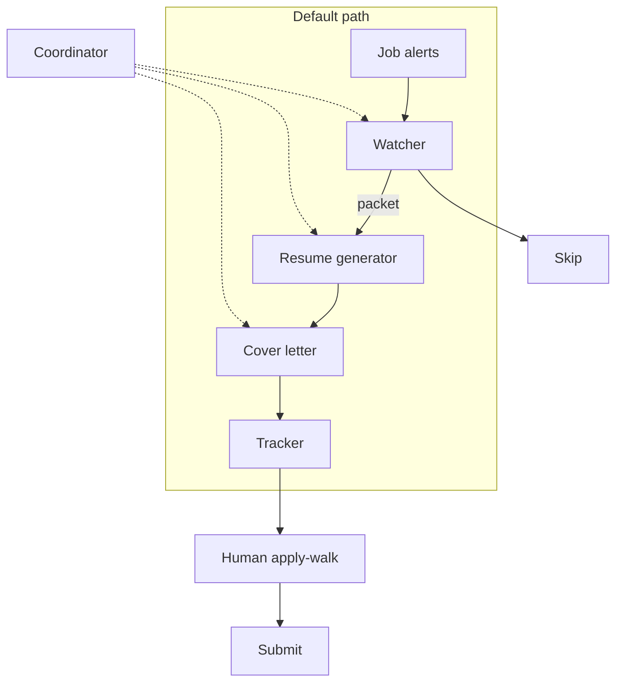

# Architecture

## Components

**Coordinator.** Sets policy. Decides the output contract (apply URL + resume + letter), the gates, the daily cap, and which specialists exist. Kicks the morning run, sends a shortfall ping only when Ready is under cap, and sends weekday afternoon outcome-mail. Does not generate documents and does not Submit.

**Watcher.** Reads new job alerts (Gmail) and targeted searches. Parses each card into a structured job (title, company, location, posting URL, job id, post date if present). Follows the posting for a full description and posted pay. Applies gates (compensation, role, freshness, dedupe). Hands a packet downstream or skips.

**Resume generator.** Takes a full job description plus a private, verified source bank. Produces a one-page resume as a Google Doc in a fixed format. Creative license on phrasing. Zero license on facts.

**Cover letter.** Takes the same JD plus the resume that was just written. Produces a short letter as a Google Doc. Updates the tracker with the third link and marks the row Ready.

**Quality reviewer (optional, off default path).** A second-pass specialist for when a human asks. Checks that resume facts are in the source bank and that the letter is grounded in that resume. Not in the morning default path.

**Tracker.** One Google Sheet (or equivalent) is the source of truth. Columns are roughly: date, company, role, salary, apply URL, resume URL, cover-letter URL, status. Humans apply from this, not from a chat log. This repo does not contain live rows or Sheet IDs.

**Human last mile.** Apply-walk: open a Ready row, attach materials, pass captcha / file pickers / login if needed, click Submit, mark Applied. Agents never click Submit.

Role-level owns / does not own: [agents.md](agents.md). Last-mile limits: [human-in-the-loop.md](human-in-the-loop.md). Cadence: [schedule.md](schedule.md).

## Stack

| Layer | Role in the pipeline |
| --- | --- |
| Cursor + Grok Bot | Agent runtime. Specialists are Grok Bot agents; routines/MCP handle schedule and tool access. |
| Persistent agent Linux computer + Chrome | Long-lived browser and filesystem for Docs/Sheets/ATS pages. Not a fresh VM every turn. |
| Gmail connector | Job-alert ingest. LinkedIn is email, not an API. |
| Google Drive connector | Source bank and generated Docs. |
| Google Docs / Sheets | Resume, letter, tracker. |
| Greenhouse, Lever, SmartRecruiters | ATS surfaces on the apply URL. Employer career pages when the watcher can resolve them. |

## Data flow

1. Alert or search result arrives in Gmail (or a search the watcher was asked to run).
2. Watcher extracts job cards. Email bodies are teasers: title, company, location, a tracking link.
3. Watcher resolves the posting: full JD, posted compensation, post date, employer apply URL when it exists.
4. Gates: salary present and above the example $200k posted floor; role match; not a duplicate job id; not historical backlog; post date present and not older than 60 days.
5. Fail → skip (logged). Pass → packet to resume generator, subject to the 10 Ready/day cap.
6. Resume generator writes a one-page Doc, returns the URL.
7. Tracker row upserted: apply URL + resume URL.
8. Cover-letter specialist writes the letter, returns the URL, fills the third column, status → Ready.
9. Optional: a human may send a packet to the Quality reviewer. Default path does not.
10. Human apply-walk. Agents do not submit applications.

## Failure modes

Ingest is dirty. The watcher is a parser and a gate because of that — not because "AI is magic at email."

| Failure | Handling |
| --- | --- |
| Digest has several unrelated roles | Per-job gates, not per-email |
| No salary on the posting | Skip. Do not infer from title or company |
| Range like $90k–$180k vs a $200k example floor | Floor on posted compensation as written. Skip if the range never reaches policy |
| No post date, or posting older than 60 days | Skip. Do not guess "probably recent" |
| LinkedIn tracking URL, not the careers page | Prefer Greenhouse / Lever / SmartRecruiters / company careers URL when found |
| Same job in two alerts | Dedupe on job id |
| Agent wants to "help" by inventing a metric | Hard rule: source bank only |
| Generating for the entire inbox on first connect | Explicit "new mail only" |
| More than 10 qualifying jobs in a morning | Cap. Extra jobs are not packets today. Shortfall ping is the inverse: only fire at 8:30am PT if under cap |
| **Greenhouse (and similar) file pickers** | Native OS file choosers are not a reliable agent surface. Human attach during apply-walk. Do not automate around the picker with random clicks |
| **Drive PDF export truncation** | A one-page Doc can clip in "Download as PDF" (last bullets, extra pages, header/footer). Generator targets one page in the Doc; human skims the PDF when attaching if the ATS wants a file. Do not silently ship a truncated export |
| **Extra tabs / popups on ATS pages** | Apply URLs often open cookie banners, "sign in with Google," new-tab previews, or a second Greenhouse tab. Agents do not chase every tab. Human last mile owns the live form |
| Captcha | Stop. Human. |
| Session login / 2FA on the agent computer | Human, once per site / device. Not a watcher job |
| Recruiter replies in the same inbox as job alerts | Not automated. Outcome-mail at 3pm PT weekdays is a digest cue for the human, not an auto-reply |

## Why specialists

A single agent that watches mail, writes resumes, and drafts letters will smear the jobs together. Resume writing needs a source bank and format constraints. Watching needs parse + fetch + gates. Letters need the resume that actually exists, not a parallel hallucination.

The coordinator exists so policy changes (floors, target titles, "output is three links," 10 Ready/day, 60-day freshness) don't require rewriting the writers.

The Quality reviewer stays off the default path so the morning run does not pay a second-pass tax on every packet. Invoke it when a human is unsure, not as a required stage.

## What is private on purpose

The live source bank, inbox, tracker rows, generated Docs, agent identifiers, connector credentials, and Drive / Sheet IDs stay out of git. This document is the map, not the house.
