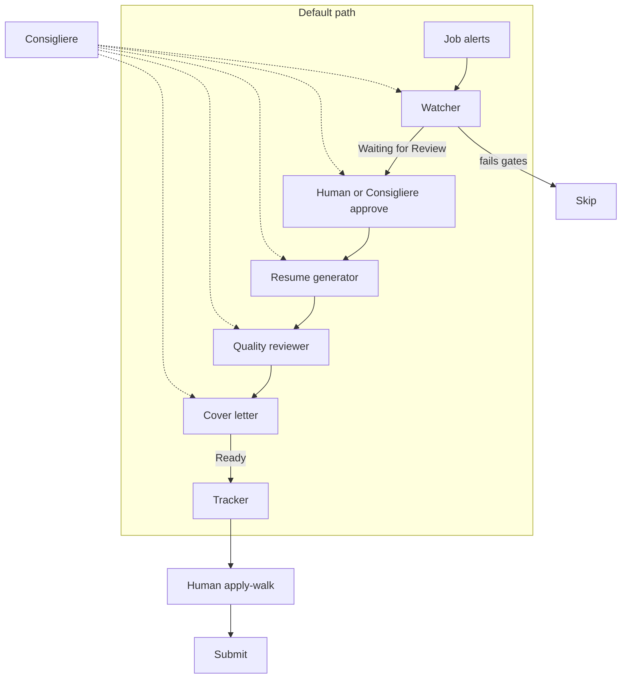

# Architecture

## Components

**Consigliere.** Works directly with the human (the boss). Keeps specialists in line, holds the human accountable, and pushes back on bad calls: spray applications, infra TPMs, generating before anyone has reviewed the row, adding tracker rows when Ready is already full. Owns policy, cadence, and form-fill up to but not including Submit. Does not write resumes or letters. Does not harvest job alerts. Does not fill 10 Ready at 7am.

**Watcher.** Reads new job alerts (Gmail) and targeted searches. Frugal on the helper computer: search and log, not a full packet per posting. Parses each card into a structured job (title, company, location, apply URL, job id, posted pay and post date if present). Applies gates (fit first, pay as a floor, skip infra, freshness, dedupe). Default handoff is a tracker row at **Waiting for Review** with the apply URL only — not a resume, not Ready. Does not kick Resume Generator until Consigliere or the human says the row is ready (slam-dunk exception below).

**Resume generator.** Takes a full job description plus a private, verified source bank. Produces a one-page resume as a Google Doc in a fixed format. Creative license on phrasing. Zero license on facts. Runs only after a Waiting for Review row is approved, or on a slam dunk.

**Quality reviewer (on the default path).** A required second pass on every packet. Checks that resume facts are in the source bank, that fit is real, and that the letter will have something honest to stand on. No resume proceeds to a cover letter without a pass. Not optional. Not "only when someone is unsure."

**Cover letter.** Takes the same JD plus the resume that just passed Quality Reviewer. Produces a short letter as a Google Doc. Updates the tracker with the third link and marks the row Ready.

**Tracker.** One Google Sheet (or equivalent) is the source of truth. Columns are roughly: date, company, role, salary, post date, apply URL, resume URL, cover-letter URL, status. Status starts as **Waiting for Review**. Ready is only after resume + letter, after human (or slam dunk) approval. Humans apply from this, not from a chat log. This repo does not contain live rows or Sheet IDs.

**Human last mile.** Apply-walk: open a Ready row, attach materials, pass captcha / file pickers / login if needed, click Submit, mark Applied. Agents never click Submit. Consigliere may fill fields and attach PDFs; Submit stays human.

Role-level owns / does not own: [agents.md](agents.md). Last-mile limits: [human-in-the-loop.md](human-in-the-loop.md). Cadence: [schedule.md](schedule.md).

## Stack

| Layer | Role in the pipeline |
| --- | --- |
| Cursor + Grok Bot | Agent runtime. Specialists are Grok Bot agents; routines/MCP handle schedule and tool access. |
| Persistent agent Linux computer + Chrome | Long-lived browser and filesystem for Docs/Sheets/ATS pages. Not a fresh VM every turn. Watcher stays frugal on it (search + log). |
| Gmail connector | Job-alert ingest. LinkedIn is email, not an API. |
| Google Drive connector | Source bank and generated Docs. |
| Google Docs / Sheets | Resume, letter, tracker. |
| Greenhouse, Lever, SmartRecruiters | ATS surfaces on the apply URL. Employer career pages when the watcher can resolve them. |

## Data flow

1. Alert or search result arrives in Gmail (or a search the watcher was asked to run).
2. Watcher extracts job cards. Email bodies are teasers: title, company, location, a tracking link.
3. Watcher resolves enough of the posting to gate it: posted compensation, post date, employer apply URL when it exists. It does **not** follow every JD into a packet.
4. Gates: fit first (HITL / evals / data ops / AI-related PM); pay is a floor, not a rank key; skip cloud infra / compute / SPMO / horizontal BizOps; salary present and above the example $200k posted floor; not a duplicate job id; not historical backlog; post date present and not older than 60 days.
5. Fail → skip (logged). Pass → tracker row at **Waiting for Review** with apply URL only. Docs wait.
6. If Ready is already ~10, **do not add rows**. Extra qualifying jobs wait until the human asks.
7. Human or Consigliere approve the row (or Watcher / Consigliere flags a **slam dunk** and skips the wait). Unapproved rows do not start Resume Generator.
8. Resume generator writes a one-page Doc, returns the URL.
9. Quality reviewer scores that resume against the JD and the source bank. Fail → revise. Pass → cover letter. Honest skip if the bank cannot support the posting.
10. Cover-letter specialist writes the letter, returns the URL, fills the third column, status → Ready.
11. Human apply-walk. Consigliere may fill and attach. Agents do not submit applications.

**Slam dunk.** A posting that is an obvious fit (right family, pay clears the floor, apply URL in hand) may go Watcher → Resume generator without waiting on the human. Quality Reviewer is still on. This is an exception, not the morning default.

## Failure modes

Ingest is dirty. The watcher is a parser and a gate because of that — not because "AI is magic at email."

| Failure | Handling |
| --- | --- |
| Digest has several unrelated roles | Per-job gates, not per-email |
| No salary on the posting | Skip. Do not infer from title or company |
| Range like $90k–$180k vs a $200k example floor | Floor on posted compensation as written. Skip if the range never reaches policy |
| Ranking by pay because the number is big | Fit first. Pay is a floor, not a rank key |
| Cloud infra / compute / SPMO / horizontal BizOps / infra TPM | Skip. Not the target family |
| No post date, or posting older than 60 days | Skip. Do not guess "probably recent" |
| LinkedIn tracking URL, not the careers page | Prefer Greenhouse / Lever / SmartRecruiters / company careers URL when found |
| Same job in two alerts | Dedupe on job id |
| Agent wants to "help" by inventing a metric | Hard rule: source bank only |
| Generating for the entire inbox on first connect | Explicit "new mail only" |
| Following every JD into a resume packet | Do not. Harvest is search + log at Waiting for Review |
| Generating before anyone reviewed the row | Default is wait. Slam dunk only |
| Ready already ~10, harvest still adding rows | Stop. Do not add rows until the human asks |
| Filling 10 Ready at 7am | Consigliere does not start generators on unreviewed rows |
| **Greenhouse (and similar) file pickers** | Native OS file choosers are not a reliable agent surface. Human attach during apply-walk. Do not automate around the picker with random clicks |
| **Drive PDF export truncation** | A one-page Doc can clip in "Download as PDF" (last bullets, extra pages, header/footer). Generator targets one page in the Doc; human skims the PDF when attaching if the ATS wants a file. Do not silently ship a truncated export |
| **Extra tabs / popups on ATS pages** | Apply URLs often open cookie banners, "sign in with Google," new-tab previews, or a second Greenhouse tab. Agents do not chase every tab. Human last mile owns the live form |
| Captcha | Stop. Human. |
| Session login / 2FA on the agent computer | Human, once per site / device. Not a watcher job |
| Recruiter replies in the same inbox as job alerts | Not automated. Outcome-mail at 3pm PT weekdays is a digest cue for the human, not an auto-reply |

## Why specialists

A single agent that watches mail, writes resumes, and drafts letters will smear the jobs together. Resume writing needs a source bank and format constraints. Watching needs parse + fetch + gates. Letters need the resume that actually exists, not a parallel hallucination.

Consigliere exists so policy changes (floors, target titles, "status starts Waiting for Review," 10 Ready as a last-mile cap not a harvest target, 60-day freshness) don't require rewriting the writers — and so someone can tell the human no.

Quality Reviewer stays **on** the default path so a weak or invented resume cannot become a letter. The morning run pays that second-pass tax on every packet that was actually approved to generate.

## What is private on purpose

The live source bank, inbox, tracker rows, generated Docs, agent identifiers, connector credentials, and Drive / Sheet IDs stay out of git. This document is the map, not the house.
